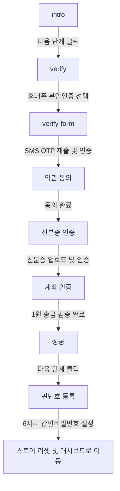

# 온보딩 퍼널 Zustand 리팩토링 설계 (Onboarding Funnel Zustand Refactoring Design)

본 문서는 로그인 및 회원가입 온보딩 플로우를 기존의 개별 Atoms/로컬 상태 방식에서 **Zustand** 스토어 및 Next.js 쿼리 파라미터 기반의 **useFunnel** 훅을 사용하는 구조로 전환하기 위한 상세 리팩토링 설계를 담고 있습니다.

## 목표 (Purpose)

사용자 흐름(`intro` -> `verify` -> `verify-form` -> `약관 동의` -> `신분증 인증` -> `계좌 인증` -> `성공` -> `핀번호 등록` -> `대쉬보드로 이동`)을 유기적이고 안전한 다단계 퍼널(Funnel)로 통합합니다. 
기존 프로젝트의 Jotai Atoms 등의 상태 관리를 `sessionStorage`에 데이터를 보관하는 단일 Zustand 스토어로 대체하여 페이지 새로고침 시에도 작성 데이터가 손실되지 않도록 방지하고, `useFunnel` 훅과 스텝 가드(Step Guard)를 통해 비정상적인 단계 진입을 차단합니다.

## 사용자 검토 필요 사항 (User Review Required)

> [!NOTE]
> 본인인증 정보, 약관 동의 여부, 신분증 정보, 계좌 인증 상태, 임시 PIN 번호 등 모든 중간 단계 온보딩 상태는 `sessionStorage` 내 `"onboarding-storage"` 키로 보관됩니다. 이 상태는 사용자가 모든 온보딩을 마치고 대시보드로 최종 이동하는 시점에 한꺼번에 리셋 처리됩니다.

## 아키텍처 및 데이터 흐름 (Architecture & Data Flow)

각 단계로의 진입 권한은 퍼널 설정에 정의된 `shouldRender` 스텝 가드 검증 조건에 의해 보호되며, 이전 단계의 필수 정보가 Zustand 스토어에 올바르게 존재하는지 점검하여 허용되지 않은 직접 링크 진입을 자동 리다이렉트 처리합니다.

## 변경 제안 사항 (Proposed Changes)

### Zustand 스토어 설정
온보딩 및 회원가입 전반의 상태를 담당하는 전용 Zustand 스토어를 생성합니다.

#### [NEW] [onboarding-store.ts](file:///Users/sunub/workspace/for-digital-divide/frontend/src/store/onboarding-store.ts)
- `OnboardingState` 및 `OnboardingActions` 정의.
- `persist` 미들웨어와 `createJSONStorage(() => sessionStorage)`를 통한 새로고침 복구 기능 제공.

### 온보딩 퍼널 페이지 리팩토링
`/login/email-password/page.tsx` 또는 독립된 퍼널 컨트롤러 페이지를 구현하여 각 하위 단계를 통합 제어합니다.

#### [MODIFY] [page.tsx](file:///Users/sunub/workspace/for-digital-divide/frontend/src/app/login/email-password/page.tsx)
- 온보딩 퍼널의 단일 진입점 역할을 하도록 리팩토링.
- `funnel.currentStepId` 값에 따라 개별 단계 컴포넌트(`IntroStep`, `VerifyStep`, `TermsStep`, `IdCardStep`, `AccountStep` 등)를 조건부 렌더링.

#### [NEW] [funnelConfig.ts](file:///Users/sunub/workspace/for-digital-divide/frontend/src/app/login/email-password/funnelConfig.ts)
- 퍼널 단계 정의(`ONBOARDING_STEPS`) 및 각 단계별 필수 상태 요구 사항 조건(`shouldRender`) 설정.

## 검증 계획 (Verification Plan)

### 수동 검증 (Manual Verification)
1. 온보딩 시작 단계(`intro`)로 접근합니다.
2. `intro` -> `verify` -> `verify-form` -> `약관 동의` -> `신분증 인증` -> `계좌 인증` -> `성공` -> `핀번호 등록` 순서대로 단계들을 완료합니다.
3. 중간 단계(예: 신분증 인증 또는 계좌 인증)에서 브라우저를 새로고침한 뒤, 입력 상태가 그대로 보존되며 동일한 단계에 머무르는지 확인합니다.
4. 이전 단계를 건너뛰고 주소창에 `?step=account`를 직접 쳐서 이동해 본 뒤, 스텝 가드 조건에 의해 첫 단계 혹은 올바른 미완료 단계로 리다이렉트되는지 확인합니다.
5. 핀번호 등록을 마친 뒤, 대시보드로 정상 리다이렉트 되는지와 `sessionStorage`에 보존되었던 온보딩 데이터가 깨끗이 초기화되었는지 검증합니다.
