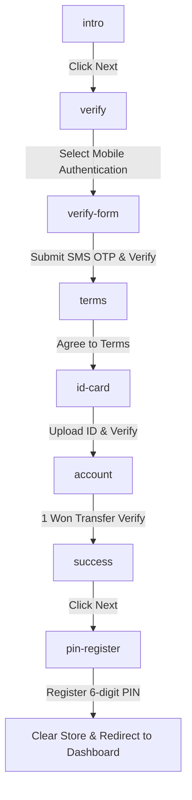

# Onboarding Funnel Zustand Refactoring Design

This document details the refactoring design for replacing the temporary local page navigation/atoms in the login and signup flow with a unified **Zustand** store and Next.js query-parameter-based **useFunnel** hook.

## Purpose

The user flows from `intro` -> `verify` -> `verify-form` -> `약관 동의` -> `신분증 인증` -> `계좌 인증` -> `성공` -> `핀번호 등록` -> `대쉬보드로 이동` need to be unified into a sequential, robust, multi-step funnel. We are replacing the scattered state management with a unified Zustand store persisted in `sessionStorage` (preventing state loss on page refresh) and utilizing the `useFunnel` hook to manage query-string-based page transitions and step-guards.

## User Review Required

> [!NOTE]
> All intermediate onboarding states (phone verification, terms agreement, ID verification, account verification, and PIN code) will be persisted in `sessionStorage` under the key `"onboarding-storage"`. This is cleared automatically only when the user completes the final step (navigating to the dashboard).

## Open Questions

None at this stage. The flow and transition logic have been aligned and approved by the user.

## Architecture & Data Flow

Each step's access is protected by step-guards (`shouldRender`) defined in the funnel configuration, verifying that the prerequisite state in the Zustand store is present and valid.

## Proposed Changes

### Zustand Store Configuration
A new Zustand store will be created to manage onboarding/sign-up state.

#### [NEW] [onboarding-store.ts](file:///Users/sunub/workspace/for-digital-divide/frontend/src/store/onboarding-store.ts)
- Defines the `OnboardingState` and `OnboardingActions`.
- Uses `persist` middleware with `createJSONStorage(() => sessionStorage)`.

### Onboarding Funnel Page
Refactor `/login/email-password/page.tsx` or create a unified funnel component that coordinates steps.

#### [MODIFY] [page.tsx](file:///Users/sunub/workspace/for-digital-divide/frontend/src/app/login/email-password/page.tsx)
- Unified entry point for the onboarding funnel.
- Renders step components conditionally based on `funnel.currentStepId`.

#### [NEW] [funnelConfig.ts](file:///Users/sunub/workspace/for-digital-divide/frontend/src/app/login/email-password/funnelConfig.ts)
- Contains step definitions (`ONBOARDING_STEPS`) and their corresponding `shouldRender` predicates.

## Verification Plan

### Manual Verification
1. Navigate to the onboarding start step.
2. Complete each step in order (`intro` -> `verify` -> `verify-form` -> `terms` -> `id-card` -> `account` -> `success` -> `pin-register`).
3. Refresh the page at any step (e.g. `id-card` or `account`) and verify that the user remains on the same step and no entered data is lost.
4. Try to navigate to `account` directly via url `?step=account` without completing previous steps, and verify that the step-guard redirects the user back to the first incomplete step.
5. Finish the onboarding flow and verify that the session storage is cleared and the user is redirected to the `/dashboard`.
