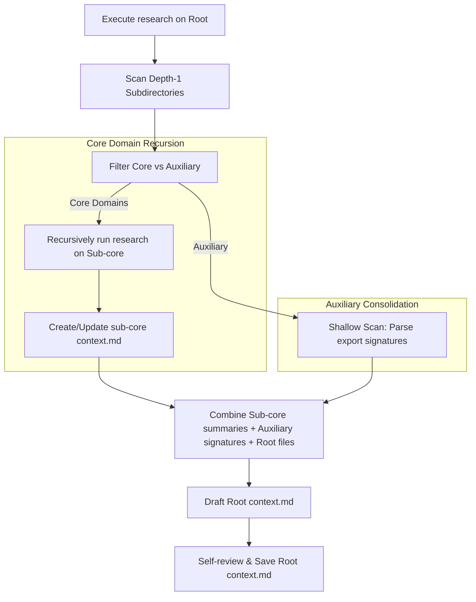

# Design Spec: Recursive Domain Context Generation (Research Skill Evolution)

## 1. Problem Statement & Goals

Currently, the `research` skill targets only a single user-specified root folder. If a complex sub-tree exists under the root folder, the agent either fails to capture deep-level context or consumes a large amount of tokens manually opening and exploring files.

### Goal
Evolve the `research` skill to recursively traverse the subdirectory structure under a designated root directory:
- Automatically categorize folders into **Core Domain** or **Auxiliary** folders.
- Recursively run the research logic on **Core Domain** folders bottom-up to build individual `context.md` files.
- Scan and extract exported signatures (hooks, utilities, types) from **Auxiliary** folders and inline them into the parent/root `context.md` without generating separate context files for them.
- Minimize token cost and tool calls using strict exploration gates.

---

## 2. Directory Classification Rule

When the skill is executed, subdirectories are categorized as follows:

| Classification | Target Directories | Action |
| :--- | :--- | :--- |
| **Core Domain** | Business flow steps (e.g., `VerifyStep`, `Pin`, `email-password`), or main route entries. | **Recursive Generation**: Run the `research` skill internally on this directory to generate/update its own `context.md`. |
| **Auxiliary** | Folders containing `hooks`, `utils`, `types`, `ui`, `style`, `components`. | **Signature Consolidation**: Extract exported function/hook signatures and types and list them in the parent `context.md` (no sub-context file created). |

---

## 3. Recursive Bottom-Up Execution Flow



---

## 4. Strict Constraints & Gates

<HARD-GATE>
**Source Code Exploration Limits**
- Do NOT read the entire contents of files inside auxiliary directories if they exceed **10KB** or **100 lines**.
- Use targeted tool reads (e.g. read the first 30 lines) or grep tool calls to parse only the exported function signatures, parameter/return types, and JSDoc blocks.
</HARD-GATE>

<HARD-GATE>
**Recursion Depth Limit**
- The maximum recursion depth is **2 (Depth 2)** relative to the initial user-specified root.
- If directory structures are nested beyond Depth 2, do NOT recurse. Instead, summarize their roles in parent files and recommend an architecture refactoring to the user.
</HARD-GATE>

<HARD-GATE>
**Excluded Folders**
- Always exclude `.git`, `node_modules`, `dist`, `.next`, `build`, `.gemini`, and any pattern defined in `.gitignore` from both traversal and scanning.
</HARD-GATE>

<CONSTRAINT>
**Manual Note Preservation**
- If an existing `context.md` has manually written comments, descriptions, or architecture notes (such as developer annotations), the generator MUST preserve them under a dedicated `## 개발자 참고 사항 (Manual Notes)` section at the top of the file instead of overwriting them.
</CONSTRAINT>

---

## 5. Document Structure Template

### Core and Root `context.md` Template

```markdown
# [Domain Name] Context

## 1. 역할 및 목적
- [Describe the business role and goals of this domain]

## 2. 하위 도메인 구성 (Core Sub-domains)
- [[Sub-domain A](file:///path/to/A/context.md)]: [Short description of Sub-domain A]
- [[Sub-domain B](file:///path/to/B/context.md)]: [Short description of Sub-domain B]

## 3. 공유 헬퍼 및 자산 (Auxiliary Modules)
### Hooks (hooks/)
- `useCustomHook(param: Type) => ReturnType`: [Hook description]

### Utilities (utils/)
- `helperFunction(arg: Type) => ReturnType`: [Utility function description]

### Types & Interfaces (types/)
- `interface CustomData`: [Type description]

## 4. 디렉토리 구조 (최대 Depth 3)
```
